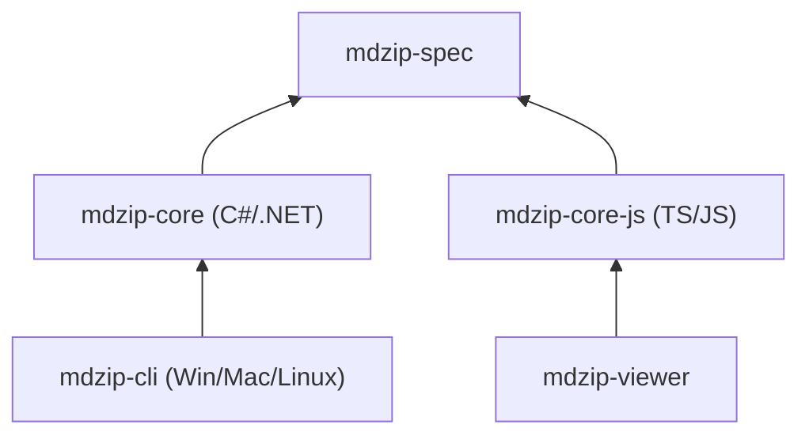

# MDZip (.mdz)

MDZip is a portable, cross-platform format for bundling Markdown documents, images, and metadata into a single `.mdz` archive.

An `.mdz` file is a ZIP archive with a defined structure, so tools can reliably locate the entry Markdown file and its related assets.

It is designed for documentation and publishing workflows that need content portability, predictable rendering, and easy distribution across tools and platforms.

Each package can include:

- Markdown documents
- Images and other referenced assets
- Structured metadata used for indexing, validation, and tooling

MDZip is supported by a growing ecosystem of tools, including a CLI, core libraries, a browser-focused viewer, and a public specification.

For full documentation, format details, and deeper guides, visit [mdzip.org](https://mdzip.org).

## Release status

Latest release and package status for core MDZip repositories.

  <table class="spec-table table-wide">
    <thead>
      <tr>
        <th>Repository</th>
        <th>Description</th>
        <th>GitHub</th>
        <th>Package</th>
      </tr>
    </thead>
    <tbody>
      <tr>
        <td colspan="4" class="table-section">Spec</td>
      </tr>
      <tr>
        <td><a href="https://github.com/mdzip-project/mdzip-spec" target="_blank" rel="noopener">MDZip-spec</a></td>
        <td><code>.mdz</code> format specification (Markdown).</td>
        <td>
          
        </td>
        <td>&mdash;</td>
      </tr>
      <tr>
        <td colspan="4" class="table-section">Core libraries for creating and extracting <code>.mdz</code> files. Based on <a href="https://github.com/mdzip-project/mdzip-spec" target="_blank" rel="noopener">MDZip-spec</a></td>
      </tr>
      <tr>
        <td><a href="https://github.com/kylemwhite/mdz-core" target="_blank" rel="noopener">mdz-core</a></td>
        <td>Platform (OS/runtime) <code>.mdz</code> core library (C#/.NET).</td>
        <td>
          
        </td>
        <td>
          
        </td>
      </tr>
      <tr>
        <td><a href="https://github.com/kylemwhite/mdz-core-js" target="_blank" rel="noopener">mdz-core-js</a></td>
        <td>JavaScript <code>.mdz</code> core library (TypeScript, browser + Node.js).</td>
        <td>
          
        </td>
        <td>
          
        </td>
      </tr>
      <tr>
        <td colspan="4" class="table-section">App library</td>
      </tr>
      <tr>
        <td><a href="https://github.com/kylemwhite/mdz-cli" target="_blank" rel="noopener">mdz-cli</a></td>
        <td>Platform (OS/runtime) CLI for create/extract (C#/.NET). Uses <a href="https://github.com/kylemwhite/mdz-core" target="_blank" rel="noopener">mdz-core</a></td>
        <td>
          
        </td>
        <td>&mdash;</td>
      </tr>
      <tr>
        <td><a href="https://github.com/kylemwhite/mdz-viewer" target="_blank" rel="noopener">mdz-viewer</a></td>
        <td>Web (browser) <code>.mdz</code> viewer library (TypeScript). Uses <a href="https://github.com/kylemwhite/mdz-core-js" target="_blank" rel="noopener">mdz-core-js</a></td>
        <td>
          
        </td>
        <td>
          
        </td>
      </tr>
    </tbody>
  </table>

