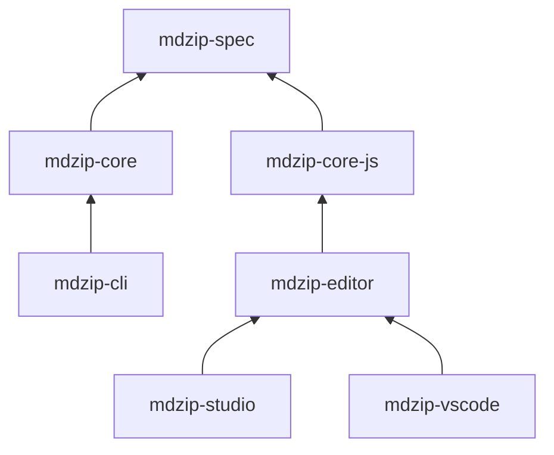

# MDZip (.mdz)

MDZip is a portable, cross-platform format for bundling Markdown documents, images, and metadata into a single `.mdz` archive.

An `.mdz` file is a ZIP archive with a defined structure, so tools can reliably locate the entry Markdown file and its related assets.

It is designed for documentation and publishing workflows that need content portability, predictable rendering, and easy distribution across tools and platforms.

Each package can include:

- Markdown documents
- Images and other referenced assets
- Structured metadata used for indexing, validation, and tooling

MDZip is supported by a growing ecosystem of tools, including core libraries (C#/.NET and TypeScript), a CLI, an embeddable editor, a VS Code extension, and the cross-platform MDZip Studio app, all built on a public specification.

For full documentation, format details, and deeper guides, visit [mdzip.org](https://mdzip.org).

```mermaid
%%{init: {"flowchart": {"htmlLabels": false}}}%%
flowchart BT
    cli["mdzip-cli"]
    studio["mdzip-studio"]
    vscode["mdzip-vscode"]
    editor["mdzip-editor"]
    core["mdzip-core"]
    corejs["mdzip-core-js"]
    spec["mdzip-spec"]

    cli --> core
    studio --> editor
    vscode --> editor
    editor --> corejs

    core --> spec
    corejs --> spec
```

## Release status

Latest release and package status for MDZip repositories.

### Specification

| GitHub Repo | Description | Release | Package |
|---|---|---|---|
| [mdzip-spec](https://github.com/mdzip-project/mdzip-spec) | `.mdz` format specification. All other repos ultimately refer to this. |  | &mdash; |

### Core libraries

| GitHub Repo | Description | Release | Package |
|---|---|---|---|
| [mdzip-core](https://github.com/mdzip-project/mdzip-core) | Platform (OS/runtime) `.mdz` core library (C#/.NET). |  |  |
| [mdzip-core-js](https://github.com/mdzip-project/mdzip-core-js) | JavaScript `.mdz` core library (`@mdzip/core-js`, TypeScript, browser + Node.js). |  |  |

### App libraries

| GitHub Repo | Description | Release | Package |
|---|---|---|---|
| [mdzip-editor](https://github.com/mdzip-project/mdzip-editor) | `@mdzip/editor`, framework-independent MDZip workspace engine and browser view. |  |  |
| [mdzip-editor](https://github.com/mdzip-project/mdzip-editor) | `@mdzip/editor-react`, React wrapper for the MDZip workspace editor. |  |  |
| [mdzip-editor](https://github.com/mdzip-project/mdzip-editor) | `@mdzip/editor-vue`, Vue wrapper for the MDZip workspace editor. |  |  |
| [mdzip-editor](https://github.com/mdzip-project/mdzip-editor) | `@mdzip/editor-ng`, Angular UI components for the MDZip workspace engine. |  |  |

### Applications & Extensions/Plugins

| GitHub Repo | Description | Release | Package |
|---|---|---|---|
| [mdzip-cli](https://github.com/mdzip-project/mdzip-cli) | Platform (OS/runtime) CLI for create/extract (C#/.NET). |  | &mdash; |
| [mdzip-vscode](https://github.com/mdzip-project/mdzip-vscode) | VS Code custom editor and bundled MCP server for reading and writing `.mdz` files, including packaged images. |  |  |
| [mdzip-studio](https://github.com/mdzip-project/mdzip-studio) | Cross-platform desktop/web application for MDZip authoring and management. The Windows install adds a File Explorer shell extension with `.mdz` preview and registration. |  |  |
